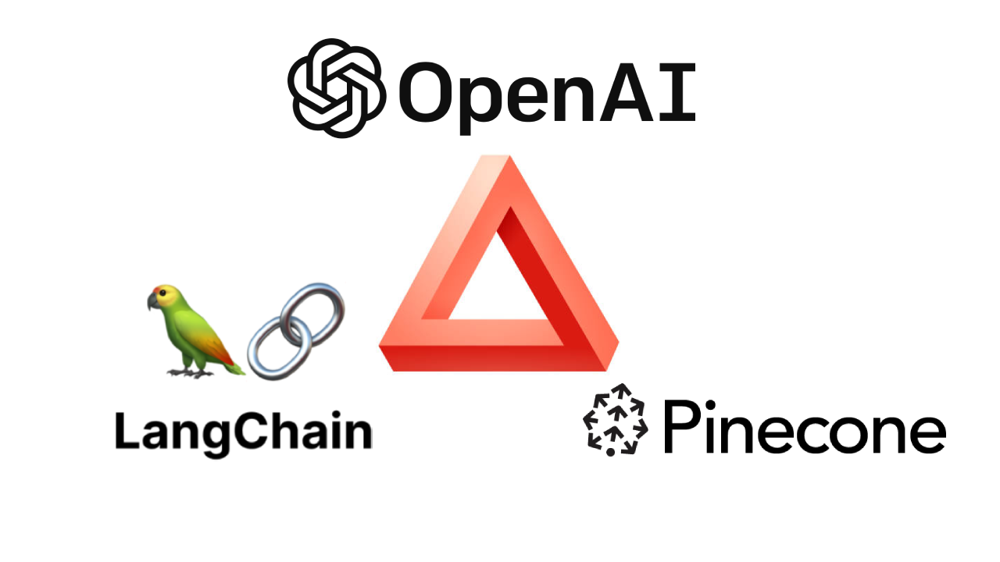

  

# nanoQA 2.0

This repo deploys a simple chat webapp that can answer about your custom data provided. It uses OpenAI endpoints, Langchain library and Pinecone vector DB.

## Demo

<video width="320" height="240" controls>
  <source src="./utils/demo2.mov" type="video/mp4">
</video>

---
## Quickstart

## Try Locally

- Clone the repo `git clone https://github.com/miranthajayatilake/nanoQA2.git`
- Move into directory `cd nanoQA2`
- Set up your `python>3.8` environment (virtual environment preferred)
- Install the depedencies `pip install -r requirements.txt`
- Assign the environment variables by running `bash env-local.sh`. Make sure you have the following API keys and variables replaced
    - OpenAI API key (OPENAI_API_KEY). You can obtain this by creating a account at [OpenAI](https://platform.openai.com/)
    - Pinecone API key and environment name (PINECONE_API_KEY, PINECONE_ENV). Obtain these by making an account at [Pinecone](https://www.pinecone.io/)
        - Next we have to create an index in the Pinecone account. You can use the `create_index.py` to do this. Make sure to provide the parameters as below.
        - `create_index.py --pinecone_api_key <asdf> --pinecone_environment <asdf> --index_name <asdf>`
    - Copy the index name used above (INDEX_NAME)
    - Provide a namespace as well (NAMESPACE) just to organize data in the database
    - Provide a name that you want your chatbot to have (EGPTNAME)
- Run the webapp with `streamlit run Chat.py`

## Deploy to cloud with [fly.io](https://fly.io/)
Fly.io is a very easy-to-use tool to deploy apps

- Clone the repo `git clone https://github.com/miranthajayatilake/nanoQA2.git`
- Create an account on [fly.io](https://fly.io)
- Install their [CLI tool](https://fly.io/docs/) called `flyctl` and configure it in your local environment
- Move into directory `cd nanoQA2`
- Run `flyctl launch`
    - Follow the instructions in the terminal. Give a name to the app and select `N` when asked whether we want any database.
    - Whenprompted to deploy, also select `N`. We have to configure the environment variables before deploying the app
- Assign the environment variables by running `bash env-flyio.sh`. Make sure you have the following API keys and variables replaced
    - OpenAI API key (OPENAI_API_KEY). You can obtain this by creating a account at [OpenAI](https://platform.openai.com/)
    - Pinecone API key and environment name (PINECONE_API_KEY, PINECONE_ENV). Obtain these by making an account at [Pinecone](https://www.pinecone.io/)
        - Next we have to create an index in the Pinecone account. You can use the `create_index.py` to do this. Make sure to provide the parameters as below.
        - `create_index.py --pinecone_api_key <asdf> --pinecone_environment <asdf> --index_name <asdf>`
    - Copy the index name used above (INDEX_NAME)
    - Provide a namespace as well (NAMESPACE) just to organize data in the database
    - Provide a name that you want your chatbot to have (EGPTNAME)
- Now run `flyctl deploy`. This command will take care of building the docker image, pushing it to the cloud and deplying. 
- Once done, we have to increase the resources of the app to run smoothly. Do this by running `flyctl machine update <machine ID> --cpus 2 --memory 4096`. Replace `<machine ID>` with the ID of your machine (Can be found via the fly.io dashboard)
- You can also get the URL for the app via the dashboard  
